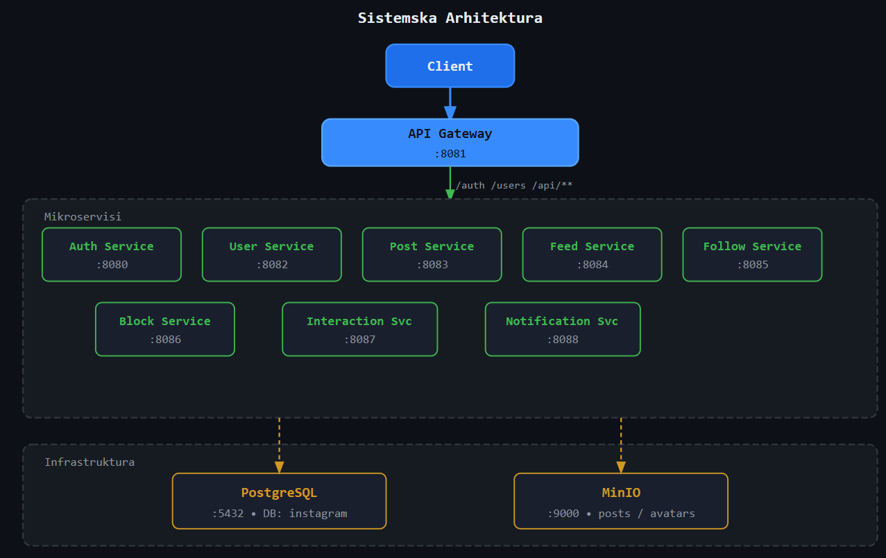
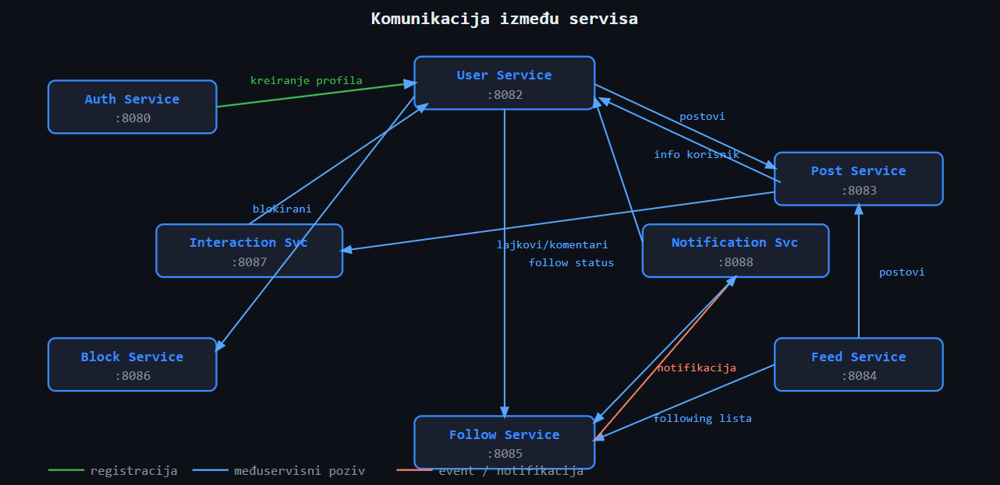
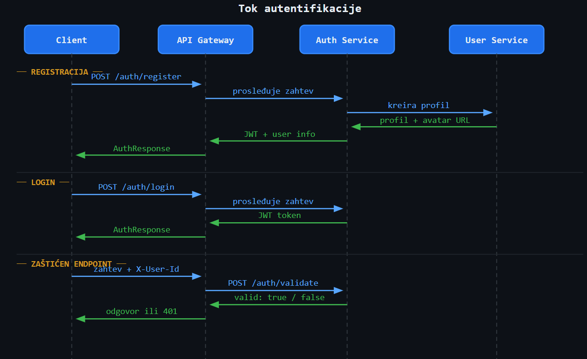

# Projektni zadatak iz predmeta Projektovanje informacionih sistema i baza podataka

[Postvaka](./Projektni_zadatak_PISIBP_2025.pdf) - Kreirati repliku društvene mreže Instagram

Projekat je radjen po ugledu na društvenu mrežu instagram, koristi mikroservisnu arhitekturu u SpringBoot-u. Svaki od servisa ima definisanu ulogu i odgovornost kao i bazu sa kojom radi.Omogućene su funkcionalnosti poput follow-a, blocka-a, kao i obljavljivanja slika videa i lajkovanja istih.
Svi zahtevi se šalju na centralni API Gateway koji dalje rutira saobraćaj i validira JWT tokene.

# Članovi tima:
* Nikola Živanović 659/2018
* Uroš Bošković 569/2016
* Aleksandar Savić 621/2022
* Marko Galetin 640/2022

---

## Tech Stack

| Tehnologija             | Verzija / Detalj        |
|-------------------------|-------------------------|
| Java                    | 21                      |
| React                   | 19.2.0                  |
| Spring Boot             | 4.0.3+                  |
| Spring Cloud Gateway    | API Gateway             |
| PostgreSQL              | Relaciona baza podataka |
| MinIO                   | Object storage (slike)  |
| JWT (HS256)             | Autentifikacija         |
| Docker & Docker Compose | Kontejnerizacija        |

---

## Arhitektura

Aplikacija koristi **API Gateway** kao jedinu ulaznu tačku. Svi klijentski zahtevi prolaze kroz gateway koji ih rutira do odgovarajućeg mikroservisa.

```
Client → API Gateway (8081) → [Microservices]
```

### Pregled servisa



---

### Komunikacija između servisa



---

### Tok autentifikacije




---
# Prerequisites

Pre pokretanja projekta potrebno je instalirati:

* Docker
* Docker Compose
* Git

---

# Kloniranje repozitorijuma

```bash
git clone <repository-url>
cd <project-folder>
```

---

# Povlačenje najnovijih izmena

Pre pokretanja projekta preporučuje se da povučete najnovije izmene:

```bash
git pull
```

---
# Konfiguracija okruženja

U root direktorijumu projekta potrebno je napraviti `.env` fajl.

Primer:

```
POSTGRES_USER=user
POSTGRES_PASSWORD=password
POSTGRES_DB=instagram
```

Ovaj fajl nije u repozitorijumu i mora se lokalno kreirati.

---

# Pokretanje svih servisa

U root direktorijumu projekta pokrenuti:

```bash
docker compose up --build
```

Ova komanda će:

* build-ovati sve servise
* pokrenuti PostgreSQL bazu
* startovati sve mikroservise

---

# Pokretanje samo jednog servisa

Ako želite da pokrenete samo jedan servis:

```bash
docker compose up auth-service
```

Ako želite da se servis ponovo build-uje:

```bash
docker compose up --build auth-service
```

---

# Provera da li servisi rade

```bash
docker ps
```

Treba da se vide kontejneri za sve servise i PostgreSQL bazu.

---

# Pregled logova servisa

```bash
docker compose logs -f auth-service
```

---

# Zaustavljanje sistema

```bash
docker compose down
```

---

# Restart sistema nakon izmena

Ako se naprave izmene u kodu servisa:

```bash
docker compose down
docker compose up --build
```

---

# Napomena

`.env` fajl nije uključen u repozitorijum iz bezbednosnih razloga i mora se lokalno kreirati.
